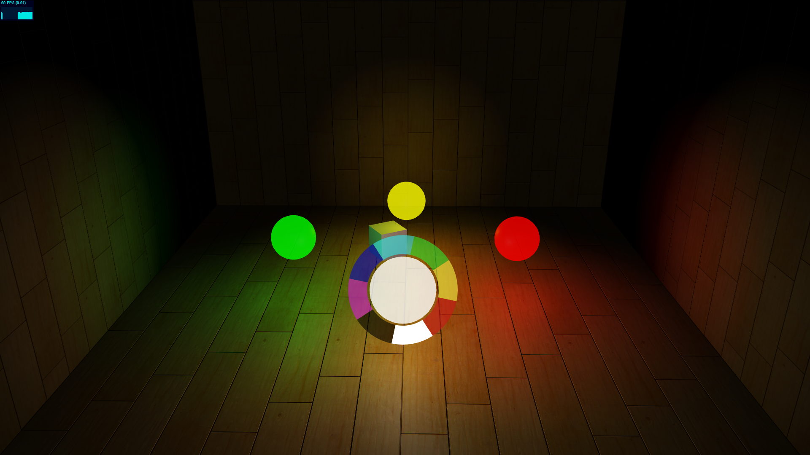

# RasPHPGPIO

## RGB LED-Control
Control RGB LEDs connected to a raspberry pi by chosing from a color wheel, rendered in three.js.
### See it in action: https://www.youtube.com/watch?v=_wSeRTchHZc

## LED-Control
Control LEDs connected to a raspberry pi by clicking on colored Orbs rendered in three.js.
### See it in action: https://www.youtube.com/watch?v=r3Now6LKsUg

